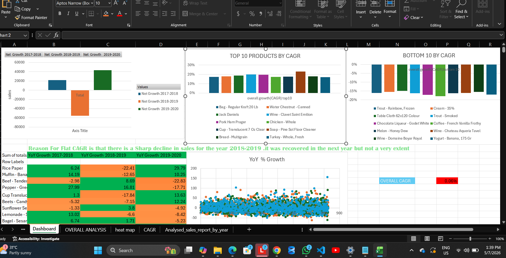
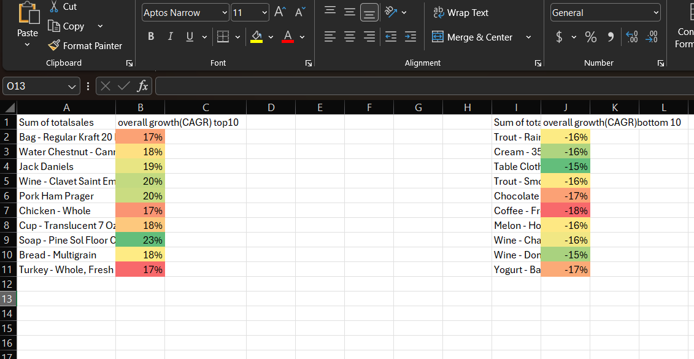
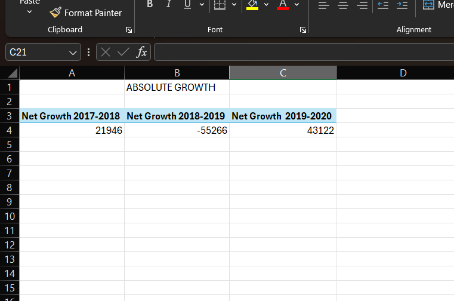
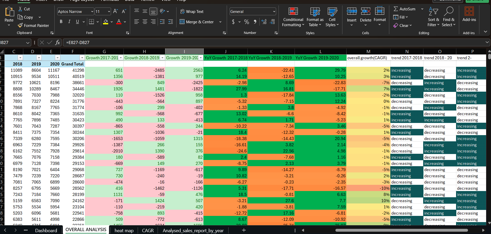

# sales-growth-analysis
SQL + Excel based analysis of product sales growth (2017–2020), including absolute growth, YoY growth, net growth, and CAGR
# 📊 Sales Growth Analysis (2017–2020)

## 📌 Overview
This project analyzes product sales growth using **SQL** for data aggregation and **Excel** for dashboard visualization.  
It covers **absolute growth, Year-over-Year (YoY) growth, net growth, and Compound Annual Growth Rate (CAGR) Analysis** to highlight portfolio trends and product‑level performance.

## 📂 Repository Structure
- `sql/Analysed_sql_extraction.sql` → SQL join + aggregation script  
- `analysis/Analysed_sales_report_by_year.xlsx` → Excel dashboard with charts and heat map  
- `visualization/` → Screenshots of dashboard visuals (Net Growth, Top/Bottom CAGR , YoY heat map, Pivot tables)  

## 📊 Key Insights
- Portfolio CAGR ≈ **0.06%** (flat growth overall).  
- Sharp decline in **2018–2019**, recovery in **2019–2020**.  
- **Top growth drivers**: packaging, beverages, household items.  
- **Bottom decliners**: meats, dairy, niche items.  
- Heat map highlights volatility across products.
- Highest Selling Product -Rice Paper
- Lowest Selling Product -Wine - Ej Gallo Sierra Valley

## 📸 Dashboard Preview
  
  
  

## 🚀 How to Reproduce
1. Run the SQL script to aggregate sales data.  
2. Open the Excel file to view dashboard charts.  
3. Explore visuals for product‑level performance.  

---
### 📌 License
This project is licensed under the **MIT License** — free to use, share, and adapt with attribution.
### 📌 License
This project is licensed under the **MIT License** — free to use, share, and adapt with attribution.
